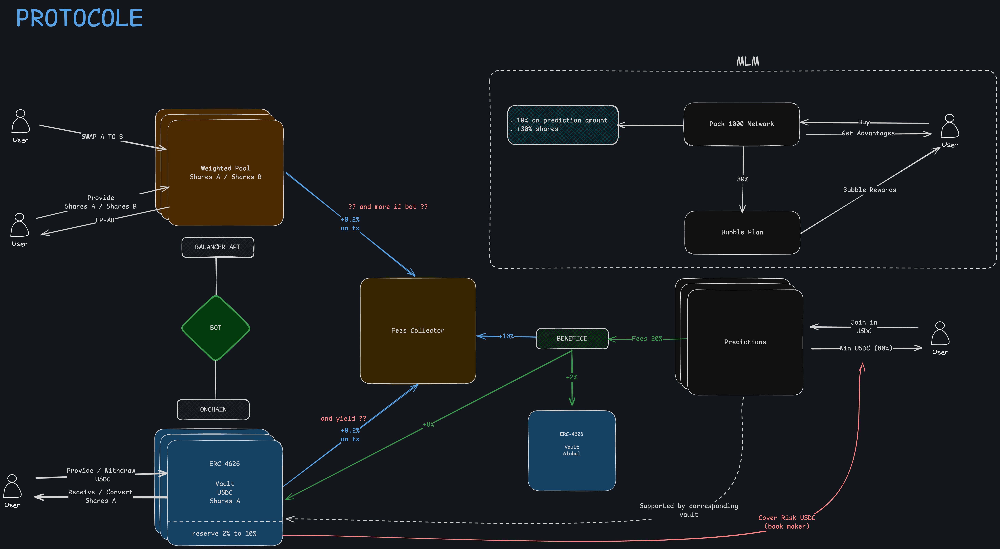
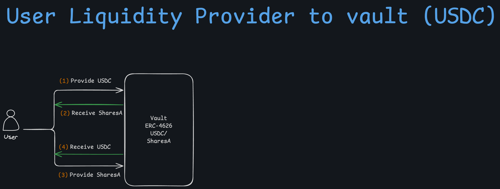
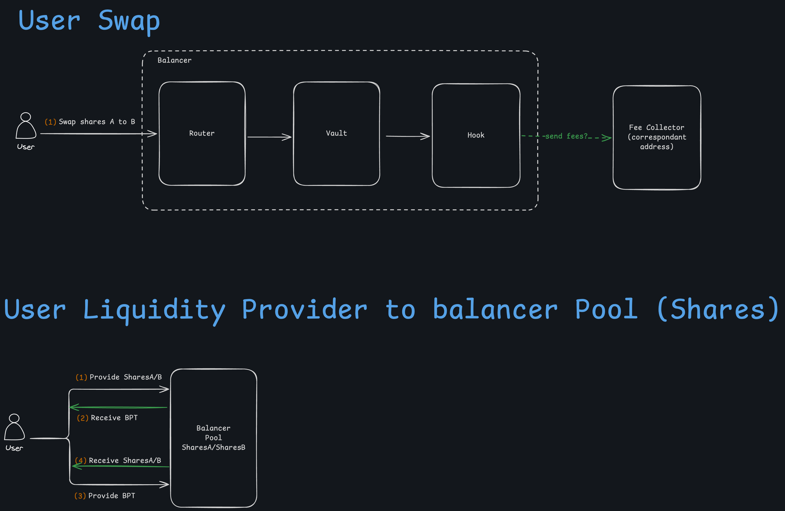
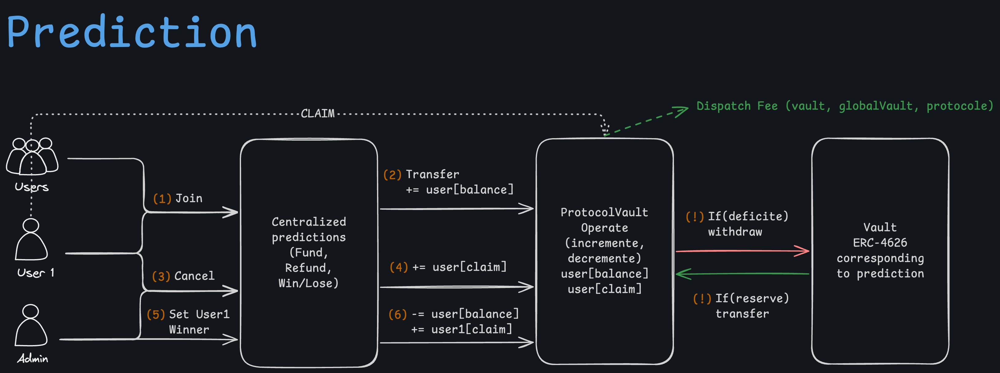
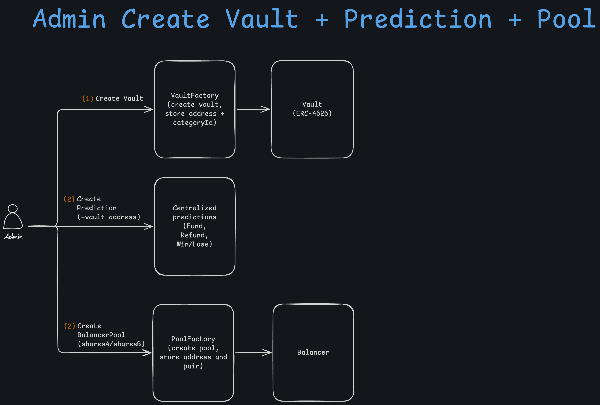

# Introduction

## Compatibilities 
- Solc version : 0.8.X
- Chains used : Base, Sepolia Base

--- 
## Overview

Le protocole permet aux utilisateurs de fournir de la liquidité, d'effectuer des échanges, et de participer à des prédictions. Les frais générés par ces activités sont collectés et redistribués pour soutenir le système (notamment via les vaults) et récompenser les participants. Une composante de réseau offre des avantages supplémentaires.  

\\[ \mu = \frac{1}{N} \sum_{i=0} x_i \\]

Ce schéma illustre le fonctionnement global du protocole, qui s'articule autour de plusieurs fonctionnalités : 

*   **1. Coffre-fort (Vault ERC-4626) :**
    *   Les utilisateurs peuvent déposer des USDC dans des **"Vault ERC-4626"** représentant des catégories de prédictions. 
    En retour, ils reçoivent des "Shares X" (jetons représentant leur part dans le vault). Ils peuvent retirer leurs USDC en échange de leurs "Shares X".

    *   Ce vault maintient une **réserve fluctuant entre 2% et 10%** de la valeur totale des USDC déposés afin de couvrir les risques liés aux prédictions (i.e bookmaker).

    *   Le vault est alimenté par les USDC générés par les fees collectés sur **les gains des prédictions (~8%)** .

    *   Le vault global est aussi alimenté par les frais collectés sur **les gains des prédictions (~2%)**.
  
    *   [**A définir**] : des frais de 0.2% sont prélevés sur les transactions withdraw basé sur le montant retiré ou sur le yield généré par le vault ?  

     
    
     
     

*   **2. Pool balancer (weighted pool) et swap**
    * Après avoir récupéré leurs "Shares X", les utilisateurs peuvent les échanger contre des BPT (balance pool token) en fournissant de la liquidité.   
    **[?? et après ¿¿]**  
    Ils peuvent aussi effectuer des swap entre les différentes shares qu'ils possèdent.

    * [**A définir**] : Il est possible de récupérer des fees sur les swaps effectués dans la pool balancer selon des critères à définir (e.g "minimum 1000$ de swap pour récupérer des fees", "if bot x% sur le bénéfice l'arbitrage réalisé") via le contrat hook.

    

    
Balancer Fees

    - Yield fees = 10% (rendement sur le prix des BPT pour LPs)
      - 50% for balancer
      - 50% for us + LPs
    - Swap fees = 10%
      - 50% for balancer
      - 50% for us + LPs
    

    >*Le système est ouvert au bot d'arbitrage qui pourront réguler les pools en se connectant à l'API balancer et au vault directement onchain*

     
      
     
     
    

*   **3. Prédictions**
    *   Les utilisateurs peuvent participer à des **"Predictions"** en USDC.

        *   Différents systèmes de prédictions sont proposées et gérées par la partie centralisée du protocole.

    *   En cas de prédiction correcte, les utilisateurs remporte la somme gagnante en USDC **- 20% fees pour le protocole**.

    *   La somme gagnante est supportée par le vault lié à la prédiction, qui maintient une réserve pour couvrir les risques associés aux prédictions.
  
       
      

---

## Admin manager

 
    

